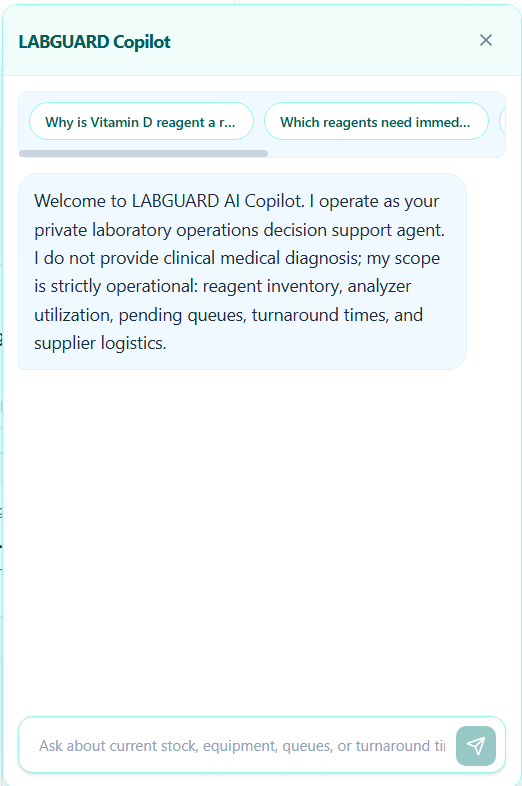
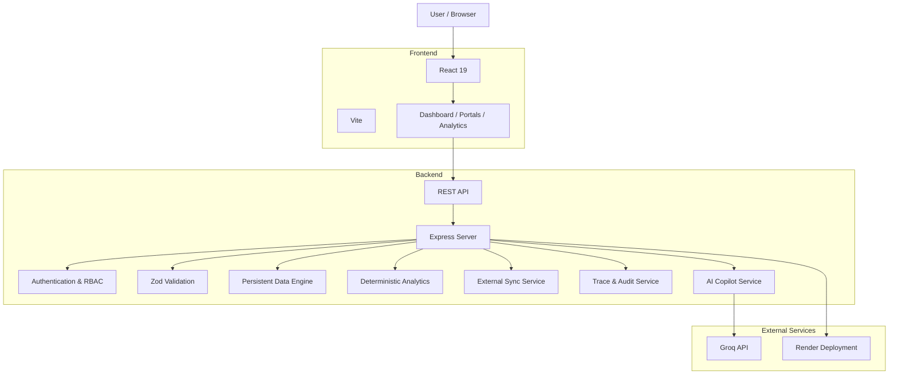
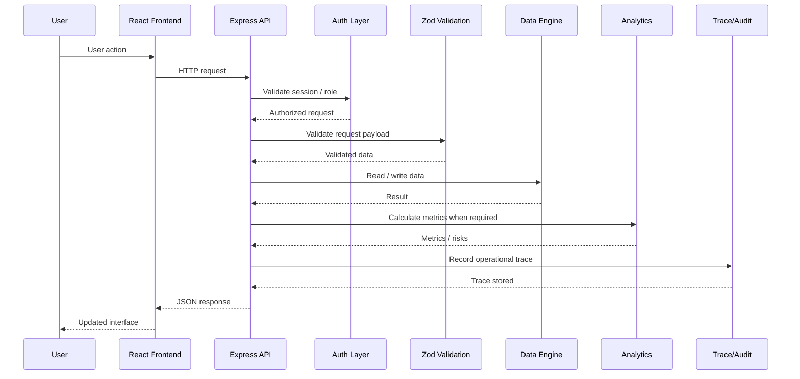

#  LABGUARD AI

### Private Laboratory Intelligence & Operations Platform 
[](https://labguard-1-qn0c.onrender.com/)
[](https://react.dev/)
[](https://www.typescriptlang.org/)
[](https://vite.dev/)

> **LABGUARD AI** is a private laboratory intelligence platform that combines laboratory operations management, role-based access, inventory and equipment monitoring, analytics, external data synchronization, explainable AI assistance, and audit tracing in a single web application.

**Live Demo:** https://labguard-1-qn0c.onrender.com/

---

## 📌 Table of Contents

* [Overview](#-overview)
* [Problem Statement](#-problem-statement)
* [Solution](#-solution)
* [Key Features](#-key-features)
* [Demo](#-demo)
* [Architecture](#-architecture)
* [End-to-End Execution Flow](#-end-to-end-execution-flow)
* [Technology Stack](#-technology-stack)
* [Repository Structure](#-repository-structure)
* [Prerequisites](#-prerequisites)
* [Installation](#-installation)
* [Environment Variables](#-environment-variables)
* [Running the Application](#-running-the-application)
* [Usage](#-usage)
* [API](#-api)
* [Security & Privacy](#-security--privacy)
* [Testing & Quality Control](#-testing--quality-control)
* [Reliability & Performance](#-reliability--performance)
* [Troubleshooting](#-troubleshooting)
* [Known Limitations](#-known-limitations)
* [Roadmap](#-roadmap)
* [Contribution Guidelines](#-contribution-guidelines)
* [Security Reporting](#-security-reporting)

---

# 📌 Overview

Laboratories operate across multiple workflows: patient registration, test orders, sample processing, equipment utilization, inventory management, billing, supplier coordination, staffing, and reporting.

LABGUARD AI provides a centralized operational interface for these workflows while adding an AI-assisted operational intelligence layer.

The platform is designed for:

* Laboratory administrators
* Lab managers
* Pathologists
* Laboratory technicians
* Hospital staff
* Pharmacy/operations teams
* Patients
* Suppliers and vendors

### Core capabilities

* Laboratory operations dashboard
* Patient management
* Test order management
* Inventory and reagent monitoring
* Equipment monitoring
* Billing and invoice workflows
* Supplier/vendor management
* Role-based authentication
* Patient self-service workflows
* Multilingual interface
* Operational analytics
* What-if / simulation workflows
* External data synchronization
* AI-powered laboratory operations copilot
* PII/privacy guardrails
* Explainable system traces
* Audit logging
* Demo telemetry simulation

---

# 🎯 Problem Statement

Laboratory operations can become fragmented across separate systems for:

* Patient records
* Test orders
* Inventory
* Equipment
* Billing
* Suppliers
* Staff workflows
* Operational analytics

This fragmentation can increase administrative overhead and make it difficult for laboratory managers to obtain a single operational view.

LABGUARD AI addresses this by providing a unified platform for laboratory operations and decision support.

---

# 💡 Solution

LABGUARD AI combines a conventional laboratory management application with an operational intelligence layer.

The application provides:

1. **Operational data management**
2. **Role-based access**
3. **Deterministic analytics**
4. **Equipment and inventory monitoring**
5. **External synchronization**
6. **AI-assisted operational reasoning**
7. **Privacy guardrails**
8. **Audit and traceability**

The AI layer is intentionally constrained to laboratory and pharmacy **operational decision support** rather than medical diagnosis or treatment.

---

# ✨ Key Features

## 1. 📊 Laboratory Operations Dashboard

Provides centralized visibility into:

* Test volume
* Completed and pending tests
* Turnaround time
* Revenue metrics
* Inventory valuation
* Equipment availability
* Operational risks
* Recommendations

---

## 2. 👥 Patient Management

Supports laboratory patient workflows including:

* Patient records
* Patient identification
* Patient search
* Status filtering
* Blood-group filtering
* Patient-specific access workflows

---

## 3. 🧪 Test Order Management

Supports the laboratory test lifecycle:

```text
Order Created
     ↓
Sample Collected
     ↓
Processing
     ↓
Completed
     ↓
Result Verification
```

The demo telemetry engine can automatically simulate transitions between processing states.

---

## 4. 📦 Inventory & Reagent Management

LABGUARD tracks:

* Inventory quantities
* Reorder thresholds
* Consumption
* Stock status
* Replenishment requirements
* Inventory valuation

The AI Copilot can use current inventory telemetry to provide operational recommendations.

---

## 5. 🔬 Equipment Monitoring

Equipment telemetry includes operational information such as:

* Equipment utilization
* Temperature
* Availability
* Maintenance information
* Pending workload

The demo environment includes simulated analyzer telemetry.

---

## 6. 🤖 AI Laboratory Copilot

LABGUARD includes a server-side AI Copilot.

When `GROQ_API_KEY` is configured, the application can use the configured Groq model.

Default model:

```text
openai/gpt-oss-120b
```

The Copilot is constrained to operational use cases such as:

* Inventory depletion
* Reagent replenishment
* Equipment utilization
* Test batching
* Turnaround time
* Staffing
* Pharmacy inventory
* Supply-chain operations

If the AI service is unavailable or no API key is configured, LABGUARD falls back to a deterministic operational engine.

### AI safety constraints

The Copilot is designed not to provide:

* Medical diagnosis
* Clinical treatment advice
* Drug prescriptions
* Disease evaluations
* Unauthorized patient information

---

## 7. 🔐 Privacy & PII Guardrails

The AI service contains checks designed to prevent general operational Copilot queries from exposing patient-specific information.

Patient-specific queries are blocked from the general Copilot workflow unless the appropriate patient-specific workflow is being used.

The platform also uses role-based access and session authentication.

---

## 8. 🧠 Explainable System Trace

LABGUARD exposes a system trace endpoint:

```text
GET /api/trace/:entityId
```

This allows operational actions and AI-related decisions to be associated with trace information.

---

## 9. 🔄 External Data Synchronization

The external synchronization service supports:

* Scheduled synchronization
* Manual synchronization
* Sync job tracking
* Record processing
* Created/updated record counts
* Error tracking
* Cached fallback data

The scheduler checks registered sources periodically.

---

## 10. 🌐 Multilingual Support

The AI Copilot supports responses in:

* English
* Hindi
* Kannada

Additional interface localization can be added as the project evolves.

---

# 🎥 Demo

## Live Application

**Live Demo:**
https://labguard-1-qn0c.onrender.com/

### Demo video

A short demo walkthrough is planned for the final project showcase and can be added here once published.

Recommended sequence:

```text
Login
  ↓
Dashboard
  ↓
Patient / Test Orders
  ↓
Inventory
  ↓
Equipment
  ↓
AI Copilot
  ↓
Risk / Analytics
  ↓
Audit / Trace
```

```text
🎥 Demo Video:
To be added after final public showcase or live demo publication.
```

---

## 🖼️ Screenshots

### Dashboard

A dashboard screenshot will be added when the final demo assets are prepared.

```text
docs/images/dashboard.png
```

```markdown

```

---

### AI Copilot

A sample Copilot interaction screenshot will be added once the final showcase assets are captured.

```text
docs/images/ai-copilot.png
```

```markdown

```

---

### Inventory / Risk Monitoring

An inventory and risk-monitoring screenshot will be captured for the final documentation set.

```text
docs/images/inventory-risk.png
```

---

### Patient Portal

The patient-facing workflow screenshot will be added with the final project assets.

```text
docs/images/patient-portal.png
```

---

# 🏗️ Architecture

LABGUARD uses a full-stack TypeScript architecture.



### Architecture principles

* Server-side API boundary
* Centralized validation
* Role-aware access control
* Persistent application state
* Deterministic analytics
* AI as an operational assistance layer
* AI fallback when external AI services are unavailable
* Auditability and traceability
* Privacy-focused handling of patient information

---

# 🔄 End-to-End Execution Flow

## Standard Application Flow



---

## AI Copilot Flow

```mermaid
flowchart LR

    Q[User Question]
       ↓
    AUTH[Role & Session Check]
       ↓
    PII[PII / Privacy Guardrail]
       ↓
    FACTS[Collect Verified Operational Facts]
       ↓
    DECISION{Groq Configured?}

    DECISION -->|Yes| GROQ[Server-side Groq Request]
    DECISION -->|No| FALLBACK[Deterministic Fallback Engine]

    GROQ --> RESPONSE[Structured Operational Response]
    FALLBACK --> RESPONSE

    RESPONSE --> TRACE[Audit / Trace]
    TRACE --> UI[Frontend]
```

---

# 🛠️ Technology Stack

| Layer          | Technology                            |
| -------------- | ------------------------------------- |
| Frontend       | React 19                              |
| Language       | TypeScript                            |
| Build Tool     | Vite                                  |
| Styling        | Tailwind CSS                          |
| UI Icons       | Lucide React                          |
| Animation      | Motion                                |
| Backend        | Node.js + Express                     |
| Validation     | Zod                                   |
| AI Integration | Groq API                              |
| AI Model       | `openai/gpt-oss-120b` by default      |
| Configuration  | dotenv                                |
| Runtime TS     | tsx                                   |
| Deployment     | Render                                |
| Data Layer     | Custom server-side persistence engine |

### Version information

The repository currently declares:

```text
React       19.0.1
TypeScript  7.0.2
Vite        8.3.0
Express     4.21.2
Node types  22.14.0
tsx         4.21.0
Zod         4.6.5
```

Verified local runtime:

```bash
node --version
npm --version
```

The project was validated locally with:

```text
Node.js  v24.15.0
npm      11.12.1
```

Use the same major runtime when validating deployment and local builds.

---

# 📂 Repository Structure

```text
LABGUARD/
│
├── src/
│   ├── App.tsx
│   ├── main.tsx
│   ├── index.css
│   ├── components/
│   ├── context/
│   ├── data/
│   ├── pages/
│   ├── types/
│   └── assets/
│
├── server/
│   ├── aiService.ts
│   ├── analytics.ts
│   ├── db.ts
│   ├── externalSync.ts
│   ├── seeds.ts
│   ├── traceService.ts
│   ├── types.ts
│   ├── validation.ts
│   └── auth/
│       ├── middleware.ts
│       └── ...
│
├── data/
├── server.ts
├── package.json
├── package-lock.json
├── tsconfig.json
├── vite.config.ts
├── index.html
└── README.md
```

---

# ⚙️ Prerequisites

## Required

* Git
* Node.js
* npm

Recommended development environment:

```text
Node.js: 24.x or later (verified locally on v24.15.0)
npm: compatible with the installed Node.js version
```

No GPU is required for the application itself.

---

# 🚀 Installation

## 1. Clone the repository

```bash
git clone https://github.com/aditisridhar84-hue/LABGUARD.git
cd LABGUARD
```

---

## 2. Install dependencies

```bash
npm ci
```

`npm ci` is recommended for reproducible installation because the repository contains `package-lock.json`.

---

## 3. Configure environment variables

Create a `.env` file:

```bash
touch .env
```

Add the required configuration.

Example:

```env
GROQ_API_KEY=your_groq_api_key
GROQ_MODEL=openai/gpt-oss-120b
DEMO_MODE=true
SESSION_IDLE_MINUTES=30
PORT=3000
```

See the complete environment-variable matrix below.

---

## 4. Start development server

```bash
npm run dev
```

The application will normally be available at:

```text
http://localhost:3000
```

---

# 🔐 Environment Variables

| Variable               | Type           | Required | Default               | Description                                     |
| ---------------------- | -------------- | -------: | --------------------- | ----------------------------------------------- |
| `GROQ_API_KEY`         | String         |       No | None                  | Server-side API key used by the AI Copilot      |
| `GROQ_MODEL`           | String         |       No | `openai/gpt-oss-120b` | Groq model used by the Copilot                  |
| `DEMO_MODE`            | Boolean/String |       No | `true`                | Enables demo-compatible authentication behavior |
| `SESSION_IDLE_MINUTES` | Number         |       No | `30`                  | Session idle timeout in minutes                 |
| `PORT`                 | Number         |       No | `3000`                | Express server port                             |
| `NODE_ENV`             | String         |       No | Runtime-dependent     | Node environment                                |
| `DISABLE_HMR`          | Boolean/String |       No | `false`               | Controls Vite HMR/file watching                 |

### Minimal configuration

The application can operate without `GROQ_API_KEY` because the AI service has a deterministic fallback mode.

For full AI Copilot functionality:

```env
GROQ_API_KEY=your_groq_api_key
```

### Security rule

**Never commit `.env` or API keys to GitHub.**

---

# ▶️ Running the Application

## Development

```bash
npm run dev
```

## Production build

```bash
npm run build
```

## Preview production build

```bash
npm run preview
```

## Start server

```bash
npm start
```

## TypeScript validation

```bash
npm run lint
```

---

# 💻 Usage

After starting the application:

```text
http://localhost:3000
```

The main workflows to demonstrate are:

### Laboratory Manager

```text
Login
→ Dashboard
→ Operational Analytics
→ Risk Center
→ Inventory
→ Equipment
→ AI Copilot
→ Trace / Audit
```

### Patient

```text
Patient Login
→ Patient Portal
→ Patient-specific information
→ Supported laboratory workflows
```

---

# 🔌 API

LABGUARD exposes REST APIs under:

```text
/api
```

Examples include:

```text
POST /api/auth/send-otp
POST /api/auth/verify-otp
POST /api/auth/staff-login
POST /api/auth/patient-login

GET /api/auth/me
GET /api/auth/users

GET /api/dashboard
GET /api/analytics

GET /api/patients
POST /api/patients

GET /api/trace/:entityId
```

The server also exposes endpoints for laboratory operations including test orders, inventory, equipment, billing, suppliers, synchronization, analytics, and Copilot functionality.

### API documentation status

The current application exposes the REST API described in this README and the server implementation. For a formal machine-readable contract, use:

```text
docs/openapi.yaml
```

and add the final specification before public release or external integration work.

---

# 🧪 Testing & Quality Control

The repository currently provides a TypeScript validation command:

```bash
npm run lint
```

Run the production build:

```bash
npm run build
```

### Recommended technical-review checks

```bash
npm ci
npm run lint
npm run build
```

Automated testing is a recommended next step before broader production release. The application already includes TypeScript validation and a production build check, and the following test categories are recommended:

```text
Unit tests
API integration tests
Authentication tests
AI fallback tests
Privacy/PII guardrail tests
Build/CI checks
```

Recommended tooling:

```text
Vitest
Supertest
ESLint
```

Once the automated suite is established, add the final commands here.

---

# 🔒 Security & Privacy

LABGUARD is designed with privacy and access control as core application concerns.

Current security-related mechanisms include:

* Session-based authentication
* Role-aware access control
* Request validation
* Origin checking for authenticated state-changing requests
* PII/privacy guardrails in the AI Copilot
* Server-side AI API calls
* Audit logging
* Traceable operational actions
* Separation of patient-specific workflows
* No requirement to expose the AI API key to the browser

### Healthcare data warning

The demonstration environment should use **synthetic data only**.

Do not upload real patient health information, personally identifiable information, medical reports, or credentials into the public demo.

---

# 📈 Reliability & Performance

LABGUARD contains several mechanisms intended to improve operational resilience:

### AI fallback

If the Groq API is unavailable, the system falls back to a deterministic operational engine.

```text
Groq available
      ↓
AI Copilot
      ↓
Structured response

Groq unavailable
      ↓
Deterministic fallback
      ↓
Operational response
```

### External synchronization fallback

When an external data source fails, LABGUARD can retain and display the most recently synchronized fallback data.

### Demo telemetry

In DEMO mode, laboratory telemetry can be simulated periodically to demonstrate changing operational state.

---

# 📊 Benchmarks

Benchmark measurements should be captured before any production-grade claim. The current project documents the intended measurement categories but does not claim final values yet.

| Metric                   | Result |
| ------------------------ | ------: |
| Initial page load        | Pending measured benchmark |
| `/api/dashboard` latency | Pending measured benchmark |
| `/api/analytics` latency | Pending measured benchmark |
| AI Copilot response time | Pending measured benchmark |
| External sync latency    | Pending measured benchmark |
| Build time               | Pending measured benchmark |

Example benchmark methodology:

```bash
npm run build
```

For API testing, use a tool such as:

```text
curl
Postman
k6
ApacheBench
```

Document the final benchmark conditions, including:

* Hardware
* Node version
* Network conditions
* Number of requests
* Average latency
* P95 latency
* P99 latency
* Throughput

---

# 🏷️ Maturity Status

**Current status: Hackathon / Demonstration Build**

The repository currently contains a deployed working application and multiple operational workflows.

This is best described as a demo or prototype build rather than a production-ready clinical or healthcare platform. That honest status is appropriate for evaluation and iteration.

---

# 🛠️ Troubleshooting

| Problem                             | Cause                              | Solution                                             |
| ----------------------------------- | ---------------------------------- | ---------------------------------------------------- |
| `npm install` fails                 | Node/npm version mismatch          | Check `node --version` and use the supported runtime |
| Application does not start          | Dependencies missing               | Run `npm ci`                                         |
| AI Copilot does not use external AI | `GROQ_API_KEY` missing/invalid     | Configure `GROQ_API_KEY` in `.env`                   |
| AI API unavailable                  | External service failure           | LABGUARD uses deterministic fallback behavior        |
| Port already in use                 | Another service is using port 3000 | Set another `PORT` value                             |
| Environment changes not reflected   | Server not restarted               | Restart the development server                       |
| Build fails                         | TypeScript/build issue             | Run `npm run lint` and `npm run build`               |
| Demo data does not change           | Telemetry simulation disabled      | Verify demo/simulation configuration                 |

---

# ⚠️ Known Limitations

1. The application is currently a hackathon/demo-oriented platform.
2. Some external integrations use simulated synchronization behavior.
3. Demo telemetry intentionally generates simulated operational events.
4. AI output depends on the configured external model when Groq is enabled.
5. Production deployment would require a formal security review.
6. Production healthcare use would require appropriate compliance, privacy, infrastructure, and organizational controls.
7. Automated test coverage should be expanded before production deployment.
8. Performance benchmarks should be established using reproducible load-test conditions.

---

# 🗺️ Roadmap

## Near Term

* [ ] Automated unit tests
* [ ] API integration tests
* [ ] CI/CD pipeline
* [ ] OpenAPI specification
* [ ] Automated security scanning
* [ ] Formal performance benchmarks
* [ ] Expanded audit reporting
* [ ] Improved accessibility testing

## Future

* [ ] Real laboratory information system integrations
* [ ] Real equipment integrations
* [ ] Advanced operational forecasting
* [ ] More external data connectors
* [ ] Expanded multilingual support
* [ ] Advanced analytics dashboards
* [ ] Production-grade observability
* [ ] Formal compliance assessment

---

# 📚 Documentation

### Current documentation

* Live application: https://labguard-1-qn0c.onrender.com/
* Repository: https://github.com/aditisridhar84-hue/LABGUARD

### Current documentation links

* API specification: planned for `docs/openapi.yaml`
* Architecture overview: this README
* Demo: https://labguard-1-qn0c.onrender.com/
* Repository: https://github.com/aditisridhar84-hue/LABGUARD

Additional project documentation can be added here as it becomes available.

---

# 🤝 Contribution Guidelines

Before submitting changes:

```bash
npm ci
npm run lint
npm run build
```

### Code style

* Use TypeScript for application code.
* Prefer strongly typed interfaces.
* Validate API input at the server boundary.
* Keep secrets out of source control.
* Keep patient information out of logs and screenshots.
* Add tests for new critical functionality.
* Keep frontend and backend responsibilities separated.
* Document new environment variables.

### Pull Request checklist

* [ ] Code builds successfully
* [ ] TypeScript validation passes
* [ ] Tests pass
* [ ] No secrets committed
* [ ] No real patient information included
* [ ] README updated where required
* [ ] Screenshots/demo updated if UI changed

---

# 🚨 Security Reporting

Please do **not** publicly disclose security vulnerabilities involving:

* Authentication
* Patient information
* API keys
* Session management
* Authorization
* Data exposure
* AI privacy controls

Security contact:

```text
Use a private maintainer email or security reporting inbox managed by the project owners.
```

Until a formal security process is configured, security-sensitive issues should not be posted publicly in GitHub Issues.

---

# 📄 License

No license has been declared for this project yet.

```text
License status: not specified
```

---

# 👥 Team

```text
Team:
- LABGUARD AI contributors — project development and demonstration work
```

Add additional maintainers or owners here as the project team is formalized.

---

# 🏆 ASYNC'26 Technical Review Checklist

Before submission, verify:

* [ ] Elevator pitch completed
* [ ] Problem statement completed
* [ ] Target users documented
* [ ] Feature list completed
* [ ] Live demo linked
* [ ] Demo video added
* [ ] Dashboard screenshot added
* [ ] AI Copilot screenshot added
* [ ] Architecture diagram added
* [ ] End-to-end flow diagram added
* [ ] Exact runtime versions verified
* [ ] Installation tested from a clean environment
* [ ] Environment variable matrix completed
* [ ] API documentation added
* [ ] Usage examples added
* [ ] Testing commands documented
* [ ] Automated tests added
* [ ] Performance benchmarks measured
* [ ] Known limitations documented
* [ ] Security reporting contact added
* [ ] License added
* [ ] Team members added
* [ ] No secrets committed
* [ ] No real patient information in screenshots/demo
* [ ] README reviewed by all team members

---

## 🧪 LABGUARD AI

**Private Laboratory Intelligence Platform**

Live Demo: https://labguard-1-qn0c.onrender.com/

Repository: https://github.com/aditisridhar84-hue/LABGUARD
